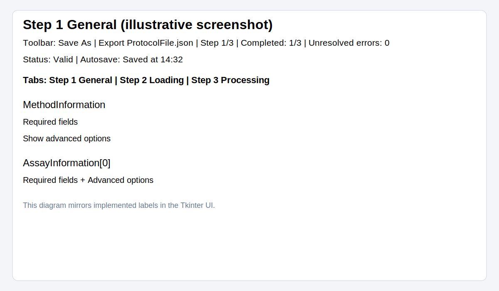
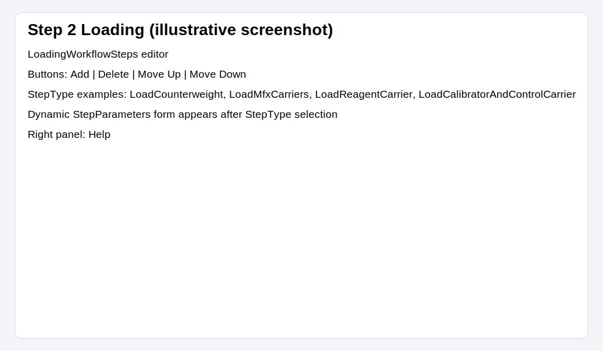
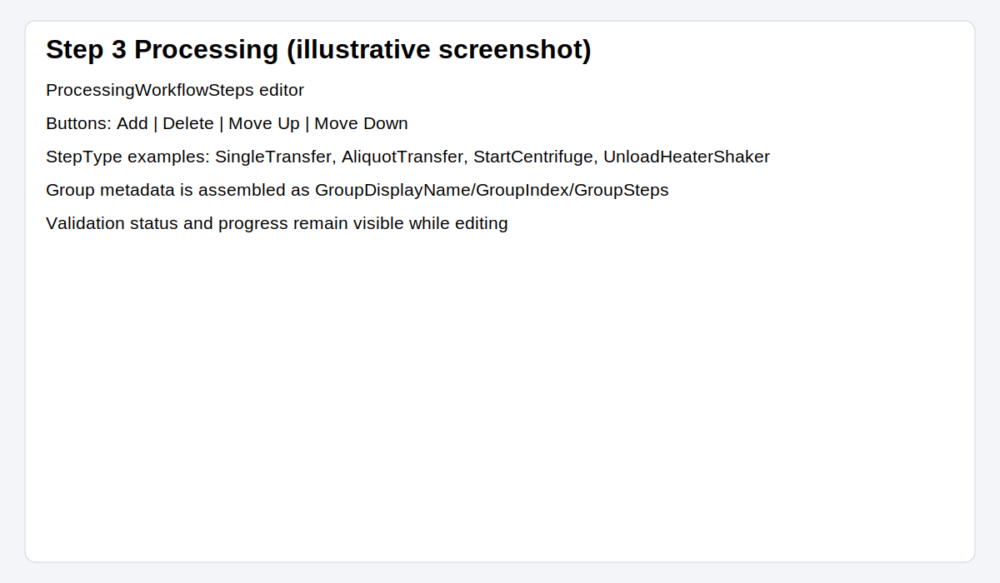

# User Guide

This guide explains how to use **Protocol Generator GUI** to author and export a valid `ProtocolFile.json`.

## 1) Before you start

- Install and launch the app from the repository root:

```bash
python -m pip install -e .
protocol-generator-gui
```

- Keep `protocol.schema.json` in the repository root unchanged unless your team intentionally updates the protocol schema.

## 2) UI tour

The window title is **Protocol Generator GUI** and the top toolbar includes:

- **Save As**
- **Export ProtocolFile.json**
- Progress text (`Step X/3 | Completed: Y/3 | Unresolved errors: Z`)
- Validation status (`Valid` or `Errors: N (...)`)
- Autosave status (`Autosave idle`, `Saving…`, `Saved at HH:MM`, `Save failed`, etc.)

### Step 1 General

Use this tab to fill:

- `MethodInformation`
- `AssayInformation[0]`

Required fields are shown first under **Required fields**, optional values are under **Advanced options** and can be revealed with **Show advanced options**.



### Step 2 Loading

Use **Add**, **Delete**, **Move Up**, and **Move Down** to manage `LoadingWorkflowSteps`.

Available loading `StepType` values are schema-driven, including:

- `LoadCounterweight`
- `LoadMfxCarriers`
- `LoadReagentCarrier`
- `LoadCalibratorAndControlCarrier`



### Step 3 Processing

Use the same controls to build `ProcessingWorkflowSteps[0].GroupSteps`.

Common processing `StepType` values include:

- `AliquotTransfer`
- `CounterweightTransfer`
- `SingleTransfer`
- `StartCentrifuge`
- `StartHeaterShaker`
- `UnloadCentrifuge`
- `UnloadHeaterShaker`



## 3) End-to-end workflow

1. **Complete Step 1 General**
   - Enter all required values for `MethodInformation` and `AssayInformation[0]`.
   - Click **Save As** and select a destination JSON file.
   - If you try to leave Step 1 before setting a save path, the app shows **Save location required**.

2. **Build Step 2 Loading and Step 3 Processing**
   - Add step rows.
   - Pick `StepType` in the dropdown.
   - Fill `StepParameters` generated for that `StepType`.
   - Reorder or remove only after confirming dialogs (**Confirm reorder**, **Confirm delete**).

3. **Validate and export**
   - Ensure status becomes **Valid** and all step indicators show `✓`.
   - Click **Export ProtocolFile.json** and select a destination directory.
   - On success, the app shows **Export complete**.

## 4) Autosave and recovery behavior

- Every change schedules autosave with a short debounce.
- Press **Esc** to cancel a pending autosave cycle.
- Before a save location is chosen, the app writes a temporary draft.
- On restart, if a temp draft exists, the app prompts **Recover draft**.

## 5) Example exported structure

```json
{
  "MethodInformation": {
    "MethodName": "Run-042",
    "ProtocolVersion": "1.0"
  },
  "AssayInformation": [
    {
      "AssayName": "Assay-A"
    }
  ],
  "LoadingWorkflowSteps": [
    {
      "StepType": "LoadCounterweight",
      "StepParameters": {
        "TipLabwareType": "TipType-A",
        "AspirationLiquidClassName": "Water",
        "RequiredCounterweightPlates": [],
        "RequiredCounterweightWater": {}
      }
    }
  ],
  "ProcessingWorkflowSteps": [
    {
      "GroupDisplayName": "Default Group",
      "GroupIndex": 0,
      "GroupSteps": []
    }
  ]
}
```

## 6) FAQ

### Why does pressing Enter switch tabs?
`Enter` advances to the next tab when your cursor is in a text entry field.

### Why can I not continue to Step 2?
You must first define a save file path with **Save As** in Step 1.

### What does `✗ (N)` beside a step mean?
That step has `N` unresolved validation errors.

### What happens if app closes unexpectedly?
A temporary draft is kept and you can reopen it from the **Recover draft** prompt at next launch.

### Why does export fail even when most fields are filled?
Export runs final schema validation. One or more required values or valid types are still missing.
